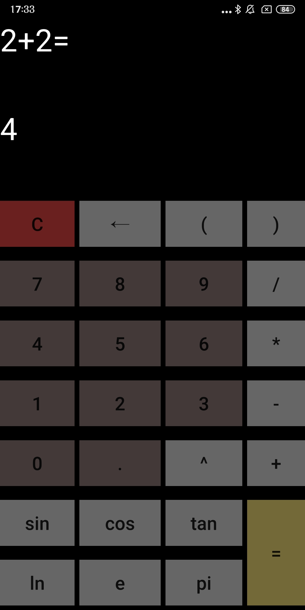
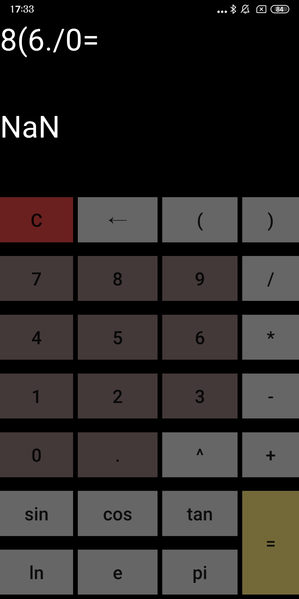

# betterCalculator
## About the program
Calculator written using Qt framework (mainly QML). Is not a "basic calculator" anymore as it supports more operations. Main motives of creation were learning QML, QML and C++ integration and trying myself in mobile development. 
## Some more details:
- battle-tested on Xiaomi Redmi Note 5 (Andriod 9), Redmi 9C NFC (Android 10) (and some no-name tablet with Android 13 OS and ARMv8 architecture).
- Needs no special permissions
- Program is built with Qt 6.5.0
- Uses [TinyExpr](https://github.com/codeplea/tinyexpr) parser for calculations
- target SDK is andriod-31 (Android 12 OS)
### Usage:
1. Find `calc3_arm7_signed.apk` or `calc3_arm8_signed.apk` (depending on your device architecture, you may try both) in the current repository and install it on phone.
You'll need to go to your phone settings and allow it to install from unknown sources (there are no viruses). And please make sure to disable play protect scanning if it didn't help (it will not let install any apps except for those registered in the store by default).
2. Once installed it is ready to go, the interface is pretty intuitive.
## Working program:

## What's "better":
- has the option to clear the last character
- exponents (^ operation)
- trigonometric functions
- two constants (e and pi)

If you ran into some issues by any chance or need to contact the developer, it would be great to recieve your valuable feedback on email: *bilenko.a.uni@gmail.com*.

<table><td>
<a href="#start-of-content">↥ Scroll to top</a>
</td></table>

